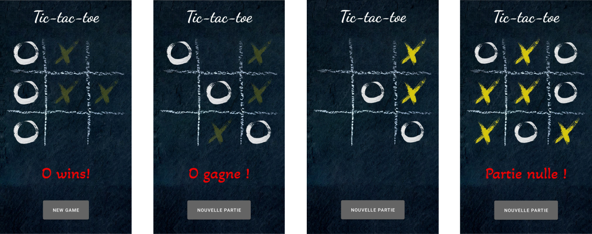

# TicTacToe

### Tic-tac-toe game developed as part of the course "Introduction aux applications mobiles"

It was developed in accordance with the task of two practical works of the course "Introduction aux applications mobiles".  
Excerpt from [the task of practical work #1](DOC/TP1.docx):

>Pour ce premier devoir, vous allez écrire le code java pour gérer un jeu de Tic-Tac-Toe, et générer les coups pour le joueur « O », celui qui joue en deuxième.
>Votre code doit obligatoirement être dans une classe nommée Jeu qui va implémenter l’interface TicTacToe.
>
>La classe Jeu doit avoir un constructeur sans paramètre.
>
>Les méthodes de l’interface à implémenter sont :
>
>initialise : Méthode pour (ré)initialiser le jeu avant de débuter une nouvelle partie. 
>
>isPartieNulle : Méthode qui va déterminer si toutes les positions de la grille sont occupées sans qu’il y ait de gagnant.  Retourne true ou false.
>
>setX : Méthode qui sera appelée par l’interface graphique pour communiquer la position choisie par le joueur « X ».  Cette méthode reçoit paramètre l’entier correspondant à l’index de la position sur la grille.
>
>gagnant : Méthode qui va recevoir la chaîne de caractères représentant le joueur, soit « X » ou « O ».  La méthode va retourner true si une ligne, une colonne ou une diagonale est entièrement occupée par ce joueur.  Dans ce cas, un tableau d’entier va contenir les 3 index de la ligne, colonne ou diagonale gagnante.  Cette méthode va retourner false si le joueur n’a pas (encore) gagné.
Les 8 combinaisons d’index de positions correspondant à une victoire sont :
(0, 1, 2), (0, 4, 8), (0, 3, 6), (6, 7, 8), (6, 4, 2), (3, 4, 5), (1, 4, 7) et (2, 5, 8).
>
>getO : Méthode qui doit déterminer le prochain coup de « O » et qui retourne l’index de la position choisie.
 
Excerpt from [the task of practical work #2](DOC/TP2.docx):

>Le devoir 2 consiste à créer une application Android, qui utilisera votre classe Jeu, pour permettre à un utilisateur d’appareil Android de jouer au Tic Tac Toe contre son appareil.
>
>Vous devez fournir les chaînes de caractères à afficher en anglais (par défaut) et en français selon la configuration de l’appareil de l’usager.
>
>Vous devez aussi permettre à l’usager de changer l’orientation de son appareil tout en continuant la même partie.
